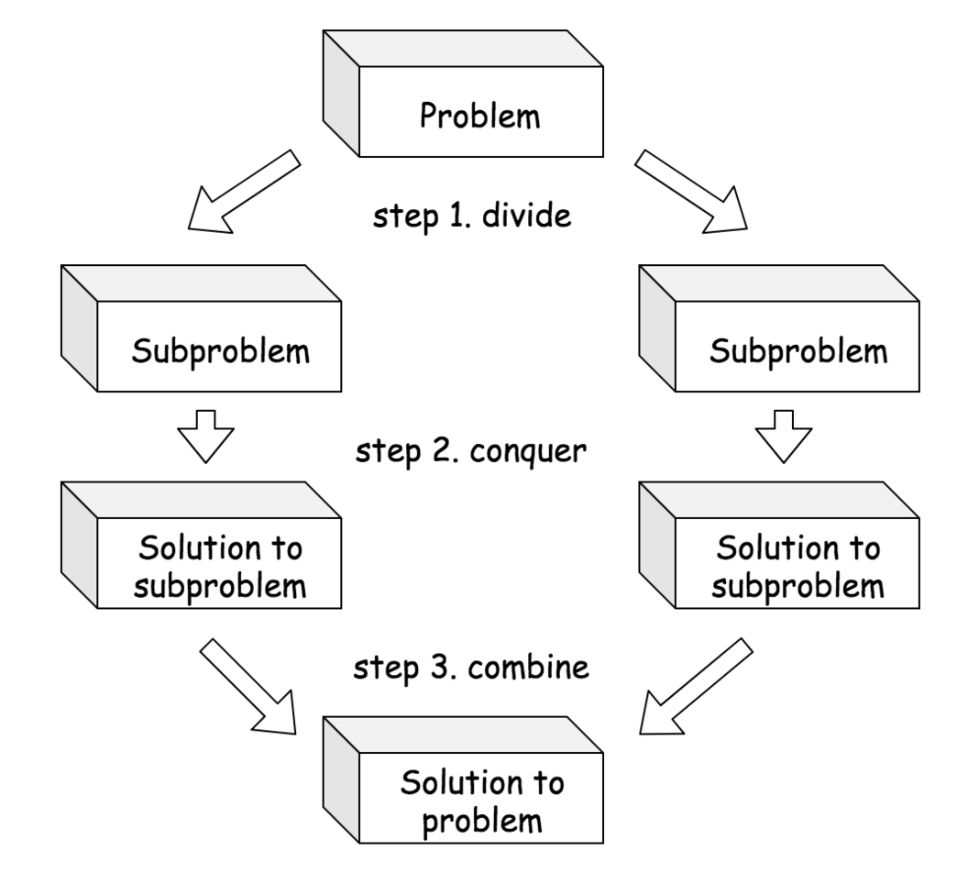
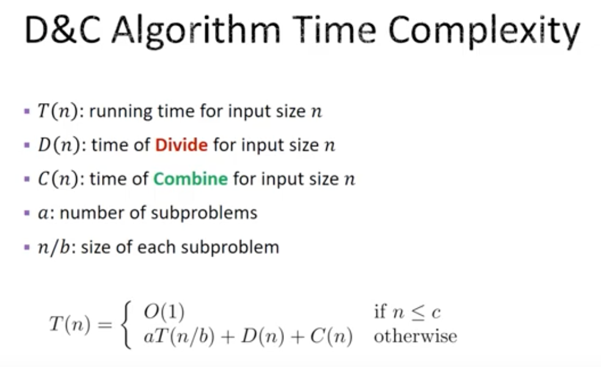

# Divide and Conquer (分治法)

`Divide and Conquer` is an `algorithm design paradigm`.

A divide-and-conquer algorithm recursively breaks down a problem into two or more sub-problems of the same or related type, until these become simple enough to be solved directly. The solutions to the sub-problems are then combined to give a solution to the original problem.

```
Breaks down a problem into sub-problem,
Solve sub-problwm recursively.
```

## Three steps

1. `Divide`

    ```
    Divide the problem into a number of subproblems that are smaller instances of the same problem.
    (比較小的同樣問題)
    ```

2. `Conquer`

    ```
    Conquer the subproblems by solving them recursively.
    ```

    - `Base case (Termination condition)`: Solve the subproblems if the subproblem sizes are small enough.

    - `Recursive case`: Recursively solve itself.

3. `Combine`

    ```
    Combine the solutions to the subproblems into the solution for the original problem.
    ```



## Divide-and Conquer Benefits

- Easy to solve difficult problems
  - Thinking: solve easiest case + combine smaller solutions into the original solution
- Easy to find a efficient algorithm
  - Better time complexity
- Suitable for parallel computing (multi-core systems)
- More efficient memory access
  - Subprograms and their data can be put in cache in stead of accessing main memory

## Time Complexity



## Exmaples

- [Tower of Hanoi](./tower_of_hanoi/)
- [Merge Sort](./merge_sort/)
- [Quick Sort](./quick_sort/)

## Reference

1. [ADA, NTU CSIE](https://www.csie.ntu.edu.tw/~yvchen/f108-ada/doc/190919_Divide-and-Conquer-1.pdf)

2. [LeetCode Learn - Divide and Conquer](https://leetcode.com/explore/learn/card/recursion-ii/470/divide-and-conquer/)

3. [Divide and Conquer, Wikipedia.](https://en.wikipedia.org/wiki/Divide-and-conquer_algorithm)
