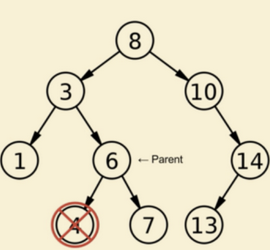
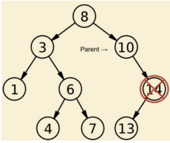

# 二元搜尋樹 (Binary Search Tree) 介紹

`二元搜尋樹 (Binary Search Tree, BST)` 就是將資料按造大小來建立樹，規則為:

- 若它的左子樹不為空，則左子樹上所有節點的值均小於它的根節點的值
- 若它的右子樹不為空，則右子樹上所有節點的值均大於它的根節點的值；
- 它的左、右子樹也分別為二元搜尋樹

如下所示:

```sh

input: [4, 2, 6, 1, 3, 5, 7]

    4
   / \
  2   6
 / \ / \
1  3 5  7
```

實作: [完整程式](./basic/)

## Traversal Binary Search Tree

Binary Search Tree 的遍歷順序有四種:
  - `Preorder Traversal (前序)`: root -> left subtree -> right subtr
  - `Inorder Traversal (中序)`: left subtree -> root -> right subtrer
  - `Traversal Postorder (後序)`: left subtree -> right subtrer -> root
  - `Level-order Traversal (層序)`: first the root, then the child of the root, etc.

如下所示:

```
    4
   / \
  2   6
 / \ / \
1  3 5  7

Preorder: [4, 2, 1, 3, 6, 5, 7]
Inorder: [1, 2, 3, 4, 5, 6, 7]
Postoder: [1, 3, 2, 5, 7, 6, 4]
Level-order: [4, 2, 6, 1, 3, 5, 7]
```

- `前三種`遍歷方式皆使用 `DFS`
  - 皆可以使用`遞迴 (recursion)` 或 `迭代(iterative)`來實作
- `Level-order Traversal` 使用 `BFS`
  - 使用`迭代(iterative)`來實作比較容易想到
- 對`二元搜尋樹(binary search tree, BST)`而言，`inorder traversal` 就是`由小到大依序遍歷`。
- It is worth noting that when you `delete nodes` in a tree, deletion process will be in post-order. That is to say, when you delete a node, you will delete its left child and its right child before you delete the node itself.

- Also, post-order is widely use in `mathematical expression`. It is easier to write a program to parse a post-order expression.

## Successor (後繼者) and Predecessor (前驅者)

- `Successor (後繼者)`: 讓每個 node 能連結到下一個節點。
- `Predecessor (前驅者)`: 讓每個 node 能連結到上一個節點

### Succecor (後繼者)

依大小來看, 比當前 node 大的下一個值又稱為 successor (繼任者)。

```sh
    4
   / \
  2   6
 / \ / \
1  3 5  7

The successor of node 4 is 5
The successor of node 2 is 3
The successor of node 6 is 7
The successor of node 1 is 2
The successor of node 3 is 4
The successor of node 5 is 6
No Successor exists for node 7
```

#### Implementation

在 BST 中，因為其規則，所以:

- `節點有右子樹`: 則 successor 為右子樹中的最小值。

- `如果給定的值小於根節點`:
  1. 更新根節點為後繼節點
  2. 訪問左子樹
- `如果給定的值大於根節點`: 則訪問右子樹


```python
def findSuccessor(root, succ_node, key):
    if root is None:
        return None

    if data == root.val:
        # 找到節點，且有右子樹，則 successor 為右子樹中的最小值
        if root.right:
            return findMinimum(root.right)
    elif data < root.val:
        # 如果給定的值小於根節點，則更新根節點為 successor，再訪問左子樹
        succ_node = root
        return findSuccessor(root.left, succ_node, data)
    else:
        # 如果給定的值大於根節點，則訪問右子樹
        return findSuccessor(root.right, succ_node, data)

    return succ_node
```

### Predecessor (前驅者)

依大小來看, 比當前 node 小的上一個值又稱為 predecessor (前驅者)

## Operations

### Searching

這邊來看一下 BST 的搜尋，如下:

```python
def search(root, target):
    if root is None or target == root.val:
        return root

    if target < root.val:
        return search(root.left, target)
    else:
        return search(root.right, target)
```

- Average case: O(logn)
- worst case: O(n)

### Insertion

```python

def insert(root, data):
    if root is None:
        root = TreeNode(data)

    if data < root.val:
        if root.left is None:
            root.left = TreeNode(data)
        else:
            insert(root.left, data)
    else:
        if root.right is None:
            root.right = TreeNode(data)
        else:
            insert(root.right, data)
```

- Average case: O(logn)
- worst case: O(n)

### Deletion

- LeetCode: [450. Delete Node in a BST](https://leetcode.com/problems/delete-node-in-a-bst/)
- Solution: [kakalin/00450_delete-node-in-a-bst](https://github.com/kaka-lin/leetcode/blob/main/leetcode/00450_delete-node-in-a-bst/450-delete-node-in-a-bst.py)

刪除有以下三種情況:

#### 1. 要刪除的節點沒有子節點 (是 leaf node)

在刪除節點沒有子節點的情況下， 單獨刪除節點就足夠了，不需要額外的改動，如下:



#### 2. 要刪除的節點有"一個"子節點

將要刪除節點的子節點複製到當前節點，並刪除 child，無須其他修改，如下:



```
如上圖，將 14 刪除的話，13 的 parent 會從 14 變成 10
也就是說，14 原來的位置被 13 取代，
10 的 right child 會指向 13 (記得right node 永遠比 parent大)
```

#### 3. 要刪除的節點有"二個"子節點

要刪除的節點的右子樹中找到最小的節點，也稱為`中序後繼(inorder successor`，並用它替換當前節點。

> Note: 因為已經右子樹中的最小值取代原本的值，所以右子樹中的最小值也要刪除。（這邊使用遞迴解決)

Example:

有一個 BST 如下所示:

```sh
delete: 3

     8
   /   \
 "3"    10
 / \     \
1   6    14
   / \   /
   4 7  13

Step 1. findMinimum(node.right) -> find node: 4
Step 2. replace 3 with 4

     8
   /   \
  4    10
 / \     \
1   6    14
   / \   /
  "4" 7  13

因為已經用 6 取代 3，等同於刪除 3，但此時右子樹的 node 4 必須刪除
所以遞迴:
Step 3. node.right = delete(node.right, 4)

Step 4. node: 6, delete key data 4
        -> key data 4 < node.val
        -> node.left = delete(node.left, data)

Step 5. node.val = 4, delete key val = 4
        但因為已經沒有 child 了所以回傳 None，結束

     8
   /   \
  4    10
 / \     \
1   6    14
     \    /
      7  13

preorder:  [8, 4, 1, 6, 7, 10, 14, 13]
inorder:  [1, 4, 6, 7, 8, 10, 13, 14]
postorder:  [1, 7, 6, 4, 13, 14, 10, 8]
```

#### Implementation

```python
def findMinimum(root):
    while (root.left):
        root = root.left
    return root


def delete(root, data):
    if root is None:
        return root

    if data == root.val:
        if root.left == None:
            root = root.right
        elif root.right == None:
            root = root.left
        else:
            # deletion of nodes with 2 children
            # find the inorder successor and replace the current node
            # inorder successor: 為右子樹中的最小值
            min_node = findMinimum(root.right)
            root.val = min_node.val
            # ** key step **
            #   recurse on root.right but with `key = root.val` (min val in right subtree)
            #
            # since we have replaced the node we want to delete
            # with the `minimum node` in right subtree,
            # now we don't want to keep the `minimum node` on this tree,
            # so we just use our function to delete it.
            # pass the val of `minimum node` to the right subtree and repeat the whole approach.
            root.right = delete(root.right, root.val)
    elif data < root.val:
        root.left = delete(root.left, data)
    else:
        root.right = delete(root.right, data)

    return root
```

## Types of Binary Search Tree

| # | arbitrary BST | Red-Black Tree | AVL Tree | Completed BST |
| :-: | :-: | :-: | :-: | :-: |
| worst search time | O(n) | O(log n) | O(log n) | O(log n) |
| maintenance after insertion | O(1) | O(1) | O(1) | O(n) |

```sh
restriction   loose   ------------------------------>  strict
                                                    (ordered array)
            arbitrary BST  Red-Black Tree  AVL Tree   Completed BST

worst
search          O(n)     >   O(log n)   ≈  O(log n)  > O(log n)
time

maintenance
after           O(1)     <    O(1)      ≈    O(1)    <   O(n)
insertion
```

- `Complete Binary Search Tree (Complete BST)`

    > 如果要維持 Complete 的性質，需要花力氣去調整 node 位置

    如下所示:

    ```
       2               3
     /   \    =>     /   \
    1     3         2     4
                   /
                  1

    2 | 1 |3  =>  3 | 2 | 4 | 1

    Time Complexity: O(n)
    ```

- [AVL Tree](./avl_tree/)

    ```
    是一種自平衡二元搜尋樹 (self-balancing binary search tree)，且
    Rebalance almost immediately
    ```

- [2-3-4 Tree](./2_3_4_tree/)

    ```
    是一種自平衡樹 (self-balancing tree)，且

    1. 相對 AVL Tree 寬鬆
    2. 用暫存維持平衡性，不會 rebalance immediately
    ```
    > 並不是 BST，用來幫助理解 Red-black Tree

- [Red-Black Tree](./red_black_tree/)

    ```
    紅黑樹 (Red-Black Tree) 是一種自平衡二元搜尋樹 (self-balancing binary search tree)，且

    1. 比 2-3-4 樹好 implement。
    2. 平衡性要求比 AVL Tree 還寬鬆。
    ```

### AVL/2-3-4/Red-Black

| # | AVL Tree | 2-3-4 Tree | Red-Black Tree |
| :-: | :-: | :-: | :-: |
| height | ≦ logn | ≦ logn | ≦2logn | O(log n) |

## Reference

- [【Python】Binary Search Tree (二元搜尋樹) 資料結構實作(1)](https://lovedrinkcafe.com/python-binary-search-tree-1/)
- [【Python】Binary Search Tree (二元搜尋樹) 資料結構實作(2)](https://lovedrinkcafe.com/python-binary-search-tree-2/)
- [在 BST 中查找給定鍵的有序後繼](https://www.techiedelight.com/zh-tw/find-inorder-successor-given-key-bst/)
- [How to delete a node from a Binary Search Tree in Python?](https://www.codespeedy.com/delete-a-node-from-a-binary-search-tree-in-python/)
